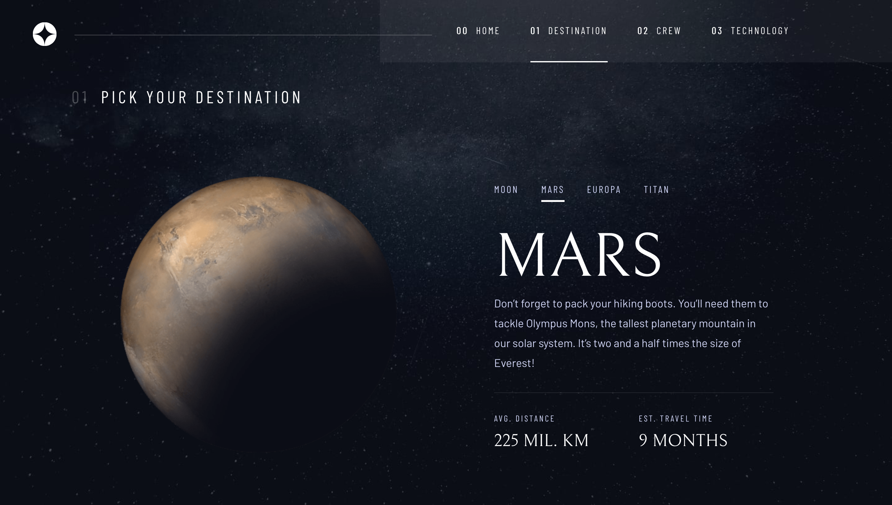

# Space tourism website

## Table of contents

- [Overview](#overview)
- [Screenshot](#screenshot)
- [Live Site Link](#live-site-link)
- [Built with](#built-with)

## Overview
A space tourism brochure website.

Users should be able to:

- View the optimal layout for each of the website's pages depending on their device's screen size
- See hover states for all interactive elements on the page
- View each page and be able to toggle between the tabs to see new information

### Screenshot

### Live site link

- [Live Site](https://space-tourism-website-ten-lime.vercel.app)

### Built with
- [Create React App](https://create-react-app.dev)
- [Frontend Mentor](https://www.frontendmentor.io/challenges/space-tourism-multipage-website-gRWj1URZ3) - Design
- [React Router](https://v5.reactrouter.com/) - Routing
- Mobile-first workflow
- Semantic HTML5 markup
- Sass
- Flexbox